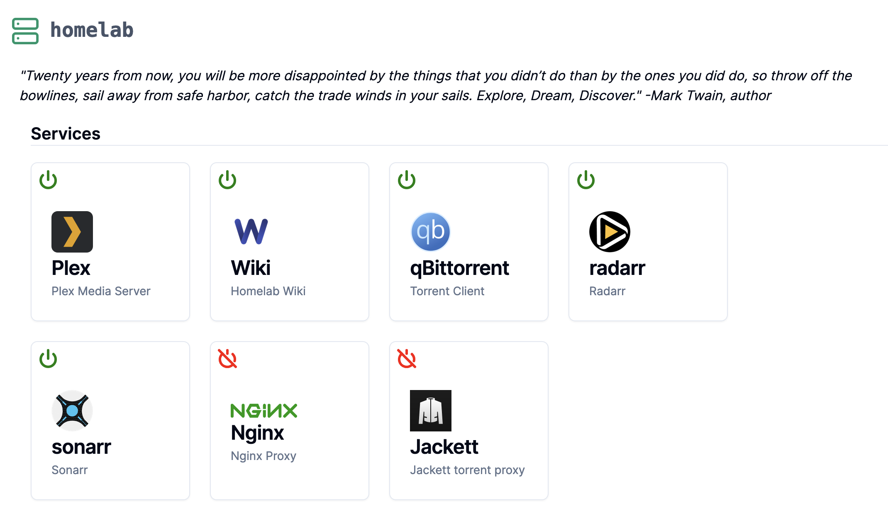

# Homelab NAS Server Dashboard

A simple Next.js dashboard for my home media server. 



## Build

```
docker build -t home-dashboard .
# or bash build.sh
```

## Configuration

Supply a yaml configuration file named `dashboard.yaml` to configure to the dashboard. E.g.,

```
Plex:
 name: Plex  <-- name as shown in UI
 url: https://plex.domain.com <-- link
 description: Plex Media Server
 icon: plex.svg <-- image for icon. can also be an https url with valid certificate. 
 containerName: plex <-- exact name of the service in your stack for status indicator icons. 

...more services
```

> `dashboard.yaml` is parsed at runtime. It is not required to build the image. 


## Run

> You must give the container access to the docker socket in order to get service status indicators. 

> There could be permission issues depending on you system. 

> Be sure your config file is mounted at container path `/config/dashboard.yaml`


```
docker run --rm --name home-dashboard -v /var/run/docker.sock:/var/run/docker.sock -v /path/to/dashboard.yaml:/config/dashboard.yaml -p <PORT>:3000 home-dashboard
```


## Run dev server

```
npx next dev
```


